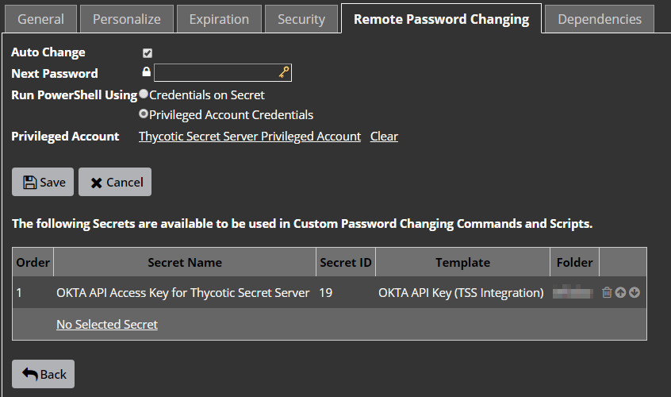
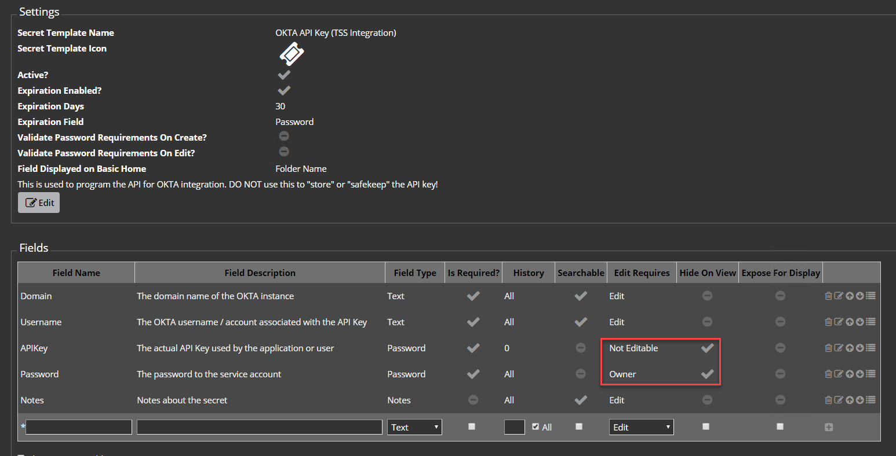

# Thycotic Secret Server integration with OKTA local account credentials

## Prerequisites

You need to create and obtain an API Key for an account in OKTA with the following Administrative permissions:
* API Access Management (to create/rotate the key for the service account as that service account, can be removed after key is created or rotated)
* Group w/ access to manage all users (to be able to enumerate all users)

  

***DO NOT*** create an API key as a normal user or your personal account! It should be an access neutral service account with MFA enabled that prevents normal login not through an API except to just create the inital API Key.

## Installation

1. Add the PS1 mentioned in the **Scripts** section below in to the scripts area on Secret Server (**ADMIN** > **Scripts**) with the appropriate script **Category** selected for each script.
2. Create a new **Password Changer** in Secret Server at **ADMIN** > **Remote Password Changing Configuration** > **Configure Password Changers** > **+ New**.
3. Define the script arguments according to the scripts parameters or as shown in the image below.

   
4. Import the Secret Templates mentioned in the **Templates** section below, with the appropriate fields security set.
5. Configure the password changing for both templates to use the password changer you set in step 2 above, you can also set the **Default Privileged Account** to the privileged API key later.
6. For each secret, including the API secret, set the **Remote Password Changing** options as follows:
   * Auto Change: Checked
   * Run PowerShell Using: Privileged Account Credentials
   * Privileged Account: `<Select the appropriate privileged account that can execute PowerShell on the Secret Server>`
   * The following Secrets are available to be used in Custom Password Changing Commands and Scripts:
     Select the OKTA API Privileged secret using the OKTA-APIKeyPrivilegedAccount.xml template. `OKTA API KEY (TSS Integration)`
     
   

## Scripts

* **OKTA-Heartbeat.ps1** - To test the validity of a credential on OKTA.
	1. `$DOMAIN` - The OKTA domain that is to be contacted (ex: _example.oktapreview.com_)
	2. `$[1]$APIKEY` - The API key generated to be used to access the APIs.
	3. `$USERNAME` - The UPN or OKTA login of the user to which the password heartbeat is checked against.
	4. `$PASSWORD` - The password to be checked.
* **OKTA-PassChange.ps1** - To change the password of a local OKTA account. Will attempt to change other sources, but may not work depending on how the directory or application integration is configured.
	1. `$DOMAIN` - The OKTA domain that is to be contacted (ex: _example.oktapreview.com_)
	2. `$[1]$APIKEY` - The API key generated to be used to access the APIs.
	3. `$USERNAME` - The UPN or OKTA login of the user to which the password is to be changed.
	4. `$PASSWORD` - The OLD password.
	5. `$NEWPASSWORD` - The NEW password.

## Templates

* **OKTA-APIKeyPrivilegedAccount.xml** - This is used to create a secret of the API Key with privileged access and the secret using this template is used by all OKTA secrets (including itself) to manage the passwords.
  * You must make sure that the OKTA API Key template have the appropriate permissions set and configured to prevent leaking of secrets to other non-administrative users selecting that secret for remote password change.
  
      * APIKey
           * Edit Requires: Not Editable (or Owner)
           * Hide on View: Checked         
      * Password
           * Edit Requires: Owner
           * Hide on View: Checked
* **OKTA-LocalServiceAccountUser.xml** - This template is used by all other OKTA accounts where the secret needs to be managed by Secret Server.